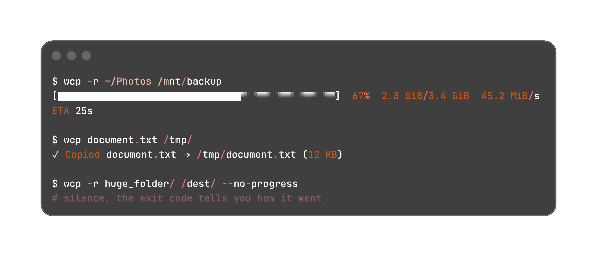

<div align="center">


# w-utils

[](https://github.com/Miro-sh/w-utils/actions/workflows/ci.yml)
[](https://github.com/Miro-sh/w-utils/releases)
[](https://deps.rs/repo/github/Miro-sh/w-utils)
[](LICENSE)


</div>

---

Unix command-line tools, rewritten in Rust with a modern UX. The first member of the suite is **wcp**, a drop-in replacement for `cp` that shows you what it's doing: a live progress bar with throughput and ETA, and copies that never leave a half-written file behind. Same flags you already know, same exit codes your scripts already check.

## Quick install

```console
$ curl -sSfL https://raw.githubusercontent.com/Miro-sh/w-utils/main/script/install.sh | sh
```

Packages and other install methods are [further down](#installation).



## Why

`cp` gives you no feedback. On a 200 GB backup you stare at a blinking cursor for twenty minutes, wondering if anything is happening at all. `wcp` answers that question and fixes a few other rough edges while it's at it: it checks free disk space before it starts, refuses to copy a directory into itself, and cleans up after itself when you hit Ctrl+C halfway through a file.

## Goals

- Drop-in replacements: same flags, same destination semantics, same exit codes as the originals. Behavior differences are bugs.
- Modern UX where it helps: live progress, clear colored errors, sensible defaults.
- Safe by default: atomic writes, pre-flight checks, nothing half-finished left behind after Ctrl+C.
- Cross-platform: Linux, macOS and Windows, with fully static Linux binaries that run on any distro.
- One package, many tools: install `w-utils` once and every utility comes with it.

## Features

- Recursive copies with a single aggregate progress bar, rsync `--info=progress2` style: percentage, copied vs total size, current speed, ETA.
- Atomic by default. Every file is written under a temporary name in the destination directory and renamed into place once complete. An interrupted copy leaves no partial files at the destination.
- Stays out of your way. The bar only appears after one second of copying, so quick copies don't flash it. Piped or scripted output disables the bar automatically, exactly how `cp` would behave.
- Full GNU `cp` flag coverage: multiple sources, `-t`/`-T`, `-i`/`-n`/`-u`/`-f`, `-L`/`-P`/`-H`/`-d`, `-p`/`--preserve`/`--no-preserve`, `-l`/`-s`, `-b`/`-S` backups, `--parents`, `-x`, `--reflink`, `--sparse`, `--remove-destination`, `--attributes-only`, `--copy-contents`, `--strip-trailing-slashes`.
- `-a` archive mode for real: permissions, timestamps, ownership (when root), hard links and xattrs preserved, directory metadata included.
- `-j N` parallel copies: many small files at once, one worker per core by default.
- `--verify` re-reads every copied file and compares xxh3 checksums before the file lands under its final name.
- `--bwlimit 10m` throttles the copy rate, shared across workers.
- `--exclude "*.tmp"` / `--exclude-from FILE` filter the copy, rsync-style globs.
- `--json` prints a machine-readable summary for scripts.
- `-v` lists every file as it is copied, like `cp -v`.
- Pre-flight disk space check with a clear error message, instead of dying at 97%.
- `--dry-run` prints the full plan before anything touches the disk, flagging files that would be overwritten.
- `--resume` skips files that are already fully copied, so relaunching an interrupted backup only transfers what's missing.
- Symlinks are recreated as symlinks. Writes through destination symlinks (and refuses dangling ones) like GNU `cp`. Fifos are recreated; sockets and device files are skipped with a warning.
- Sparse files stay sparse: zero blocks are detected and skipped instead of written.
- `--reflink=auto` uses CoW clones (FICLONE/clonefile) on btrfs, xfs and APFS, with silent fallback to a regular copy.
- Ships with a man page (`man wcp`) and bash/zsh/fish completions, generated from the CLI definition so they never drift from `--help`.

## wcp vs cp

Everything GNU `cp` does, `wcp` does the same way: every flag, the destination rules, the exit codes, writing through symlinks, refusing dangling ones, `-i/-n/-u` last-one-wins, backups, sparse files, reflinks. The CI test suite runs both tools on the same scenarios and diffs the resulting trees.

On top of that, a handful of **deliberate** differences — each one is a fix or an improvement, never an accident:

| Situation | GNU `cp` | `wcp` |
|---|---|---|
| Ctrl+C or error mid-file | Partial file left at the destination | Nothing left: files land under their final name only once complete (temp file + atomic rename) |
| Overwriting a file that has other hard links | Writes through: every link sees the new content | Replaces the destination: other links keep the old content (the safe default, like `--remove-destination`) |
| Copying onto a symlink | Truncates the target in place | Replaces the target atomically; the symlink itself is preserved |
| Destination is read-only | Fails unless `-f` | Succeeds: the atomic rename never *opens* the destination, so `wcp` always behaves like `cp -f` |
| Destination `newdir/` doesn't exist | Errors out | Creates it as a directory (rsync's trailing-slash convention) |
| Not enough disk space | Dies mid-copy | Refuses to start, with the exact numbers |
| Long copy | Silent, blinking cursor | Progress bar with speed and ETA after 1s (never in pipes/scripts) |
| Many small files | One at a time | `-j N` parallel workers (one per core by default) |
| Trusting the copy | Read it back yourself | `--verify` compares xxh3 checksums before the file is visible |
| Scripts | Parse stderr, guess state | `--json` machine-readable summary, `--dry-run` plan, `--resume` for restarts |
| Bandwidth | No control | `--bwlimit 10m` global throttle |

And the honest limitations:

- SELinux/SMACK contexts (`-Z`, `--context`) are not handled — `--preserve=context` prints a warning and moves on. Everything else in `--preserve=all` (mode, ownership, timestamps, links, xattrs) is fully supported.
- `--debug` is not implemented.
- Error messages are in French and colored; exit codes match `cp` exactly (0 success, 1 any failure, 2 usage error), so scripts that check `$?` are unaffected.

## Installation

Quick install script (Linux and macOS):

```console
$ curl -sSfL https://raw.githubusercontent.com/Miro-sh/w-utils/main/script/install.sh | sh
```

Native packages, from the [releases page](https://github.com/Miro-sh/w-utils/releases):

```console
# macOS / Linux (Homebrew)
$ brew install Miro-sh/tap/w-utils

# Debian / Ubuntu
$ sudo dpkg -i w-utils-x86_64-unknown-linux-musl.deb

# Fedora / RHEL / openSUSE
$ sudo rpm -i w-utils-x86_64-unknown-linux-musl.rpm

# Arch Linux (AUR)
$ paru -S w-utils-bin
```

Raw binaries are there too (unpack, put `wcp` on your `PATH`). Every release ships a `SHA256SUMS.txt` covering all artifacts:

```console
$ curl -sSfLO https://github.com/Miro-sh/w-utils/releases/latest/download/SHA256SUMS.txt
$ sha256sum -c SHA256SUMS.txt --ignore-missing
```

And if you have a [Rust toolchain](https://rustup.rs/):

```console
$ cargo install --git https://github.com/Miro-sh/w-utils
```

Or from a clone:

```console
$ git clone https://github.com/Miro-sh/w-utils
$ cd w-utils
$ cargo install --path .
```

This puts a fully static `wcp` binary in `~/.cargo/bin`. Delete `.cargo/config.toml` if you'd rather build for your native target.

## Usage

```
wcp [OPTIONS] <SOURCE...> <DESTINATION>
```

All GNU `cp` flags work as expected:

| Flag  | Long                    | Effect                                             |
|-------|-------------------------|----------------------------------------------------|
| `-r`/`-R` | `--recursive`       | Copy directories (required, like `cp -r`)          |
| `-a`  | `--archive`             | `-dR --preserve=all`                               |
| `-d`  |                         | `--no-dereference --preserve=links`                |
| `-L`  | `--dereference`         | Always follow symlinks                             |
| `-P`  | `--no-dereference`      | Never follow symlinks                              |
| `-H`  |                         | Follow command-line symlinks only (default)        |
| `-i`  | `--interactive`         | Prompt before overwrite                            |
| `-n`  | `--no-clobber`          | Never overwrite                                    |
| `-u`  | `--update[=WHEN]`       | Overwrite only if source is newer                  |
| `-f`  | `--force`               | Remove destination if it cannot be opened          |
| `-p`  | `--preserve[=LIST]`     | Preserve mode,ownership,timestamps (+links,xattr)  |
|       | `--no-preserve=LIST`    | Don't preserve the listed attributes               |
| `-l`  | `--link`                | Hard link instead of copying                       |
| `-s`  | `--symbolic-link`       | Symlink instead of copying                         |
| `-b`  | `--backup[=WHEN]`       | Back up overwritten files (simple/numbered)        |
| `-S`  | `--suffix=SUFFIX`       | Backup suffix (default `~`)                        |
| `-t`  | `--target-directory=DIR`| Copy all sources into DIR                          |
| `-T`  | `--no-target-directory` | Treat DEST as a normal file                        |
|       | `--parents`             | Recreate the full source path under DEST           |
| `-x`  | `--one-file-system`     | Stay on this file system                           |
|       | `--reflink[=WHEN]`      | CoW copy on btrfs/xfs/APFS (always/auto)           |
|       | `--sparse=WHEN`         | Sparse file handling (auto/always/never)           |
|       | `--remove-destination`  | Remove each destination before copying             |
|       | `--attributes-only`     | Copy attributes only, not file contents            |
|       | `--copy-contents`       | Copy special file contents when recursive          |
|       | `--strip-trailing-slashes` | Remove trailing slashes from sources            |
| `-v`  | `--verbose`             | Print each file as it is copied                    |

Plus the `wcp` extras:

| Flag  | Long                 | Effect                                          |
|-------|----------------------|-------------------------------------------------|
| `-j N`| `--jobs=N`           | Parallel copies (0 = one worker per core, max 8)|
|       | `--verify`           | Checksum every copied file (xxh3)               |
|       | `--bwlimit=RATE`     | Throttle copy rate (e.g. `10m`, `512k`)         |
|       | `--exclude=PATTERN`  | Skip files matching a glob (repeatable)         |
|       | `--exclude-from=FILE`| Read exclusion patterns from a file             |
|       | `--json`             | Machine-readable summary on stdout              |
|       | `--progress`         | Force the progress bar on                       |
|       | `--no-progress`      | Force the progress bar off (for scripts)        |
|       | `--dry-run`          | Print the plan without copying anything         |
|       | `--resume`           | Skip already-copied files, finish the rest      |

```console
$ wcp report.pdf ~/Documents/
$ wcp -ra ~/Photos /mnt/backup/photos
$ wcp -rv projects/ /external-drive/
$ wcp -inu file1.txt file2.txt file3.txt dest/   # several sources at once
```

Destination semantics match `cp`: an existing directory receives the source inside it under its original name, anything else is treated as the target file name. One deliberate extension: a trailing `/` on a destination that doesn't exist yet is taken as a directory to create, the way rsync reads it.

## What happens when things go wrong

- Ctrl+C during a copy deletes the temporary file in progress and exits with code 130.
- A file that can't be read or written is reported by name, the rest of the copy continues, and the process exits with code 1 at the end.
- Not enough free space at the destination is detected before a single byte gets copied.
- Copying a directory into one of its own subdirectories is refused up front. No infinite `a/b/b/b/b` recursion, ever.

## Performance notes

With the progress bar off, files go through `std::fs::copy`, which uses `copy_file_range(2)` on Linux and never leaves the kernel. With the bar on, `wcp` copies through a userspace buffer so it can count bytes as they pass: 256 KiB normally, 4 MiB for files above 1 GiB. In practice both paths saturate an NVMe drive. The buffered path costs a few percent on very fast storage and nothing you'd notice on anything slower.

## Uninstall

It depends on how you installed:

```console
# install script or manual copy (user install: look in ~/.local instead)
$ sudo rm /usr/local/bin/wcp /usr/local/share/man/man1/wcp.1.gz

# Debian / Ubuntu
$ sudo apt remove w-utils

# Fedora / RHEL / openSUSE
$ sudo dnf remove w-utils

# Rust toolchain
$ cargo uninstall w-utils
```

## Development

```console
$ cargo build --release   # compiles with zero warnings
$ cargo test              # 73 unit and integration tests
```

Four small modules: `main.rs` handles orchestration, `cli.rs` defines the CLI (every GNU `cp` flag) and resolves it into an effective config, `copy.rs` plans and executes the copy, `progress.rs` owns the bar, `utils.rs` does formatting and terminal detection. New tools join the suite as additional `[[bin]]` targets in `Cargo.toml`.

## Contributing

Issues and pull requests are welcome on [GitHub](https://github.com/Miro-sh/w-utils).

## License

MIT
